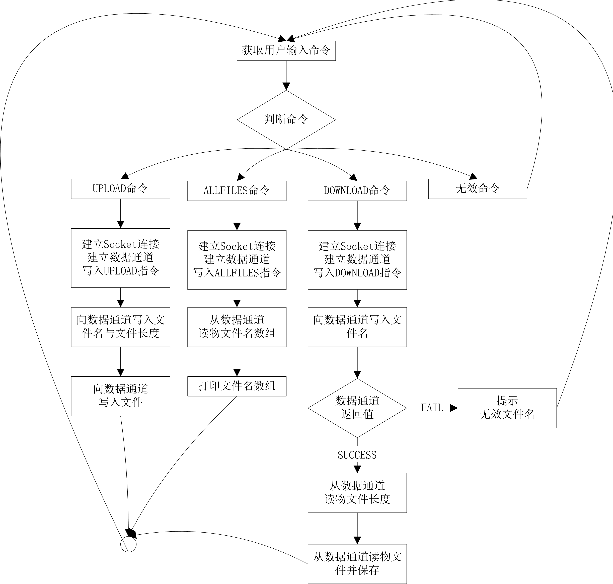

# 局域网文件共享器 文件传输部分
### 2020-5-16： 实现了客户端到服务端的双向数据传输
## 简介
使用Socket编程实现了客户端与服务端的双向文件传输。采取客户端（主动）—— 服务端（从动）的方式，在客户端处理用户的命令，然后与服务端建立Socket连接并发送相关指令，完成相应的文件传输任务。具体文件传输过程见下文“程序逻辑”。服务端采取多线程的方法，满足同时与多个客户端通讯。
## 测试说明
项目在本地使用```8080```端口模拟运行。服务器地址：```127.0.0.1```  
.\fileTest\ServerFile 文件夹为服务端文件仓库  
.\fileTest\ClientFile 文件夹为客户端文件仓库  
测试时在客户端的运行终端上输入命令。命令格式及功能如下：

```UPLOAD <file name>``` 将客户端仓库中名为<file name>的文件上传到服务端仓库
```DOWNLOAD <file name>``` 将服务端仓库中名为<file name>的文件下载到客户端仓库
```ALLFILES``` 查看服务端仓库中的全部文件名

## 程序逻辑
### 客户端指令判断活动图
描述了客户端程序如何判断用户输入，并执行相关处理


### 客户端指令判断活动图
描述了服务端如何监听客户端发来的指令，并执行相关处理


### 文件上传时序
描述了当客户端检测到用户输入UPLOAD指令时，客户端与服务端的通讯过程


### 文件下载时序
描述了当客户端检测到用户输入DOWNLOAD指令时，客户端与服务端的通讯过程(HAPPT PATH)


### 全部文件名查询时序
描述了当客户端检测到用户输入UPLOAD指令时，客户端与服务端的通讯过程

